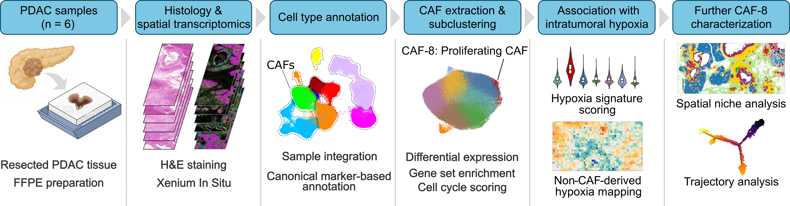
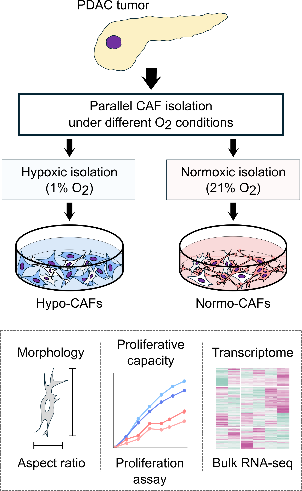

# PDAC_CAF_hypoxia_analysis

Analysis pipeline for the manuscript

**"A Proliferating CAF State Associated with Intratumoral Hypoxia in Pancreatic Ductal Adenocarcinoma"**

> **Note**
>
> This repository accompanies a manuscript that is currently under review.
> The manuscript title and citation information will be updated after publication.

## Overview

This repository contains the complete analysis pipeline used in our study investigating the relationship between intratumoral hypoxia and cancer-associated fibroblast (CAF) heterogeneity in pancreatic ductal adenocarcinoma (PDAC).

The repository contains workflows for:

- Xenium spatial transcriptomics analysis
- CAF subclustering
- Hypoxia mapping
- Spatial niche analysis
- Pseudotime trajectory analysis
- Ex vivo CAF isolation assays
- Bulk RNA-seq analysis
- Generation of all main and supplementary figures

The scripts are organized into sequential analysis modules, beginning with prepared input data and ending with generation of all main and supplementary figures. Each analysis module produces outputs that are used by subsequent modules in the pipeline.

## Highlights

- End-to-end analysis pipeline for the accompanying PDAC CAF study
- Reproducible workflows from processed input data to all main and supplementary figures
- Xenium spatial transcriptomics and bulk RNA-seq analyses
- Automated generation of all main and supplementary figures
- Modular workflow with clearly separated analysis stages

## In situ spatial transcriptomics analysis



## Ex vivo analysis of isolated CAFs



## Repository structure

The repository is organized into separate directories for analysis code, input data, generated outputs, and documentation.

```text
PDAC_CAF_hypoxia_analysis/
├── code/
│   ├── 00_config/
│   ├── 01_xenium_preprocessing_integration_initial_clustering/
│   ├── 02_caf_subclustering/
│   ├── 03_hypoxia_mapping/
│   ├── 04_niche_analysis/
│   ├── 05_pseudotime_analysis/
│   ├── 06_caf_isolation_assays/
│   ├── 07_bulk_rnaseq/
│   └── 08_figures/
├── docs/
│   └── images/
├── inputs/
│   ├── bulk_rnaseq/
│   ├── caf_isolation/
│   ├── gene_sets/
│   └── xenium/
├── outputs/
│   ├── bulk_rnaseq_outputs/
│   ├── caf_isolation_outputs/
│   └── xenium_outputs/
├── PDAC_CAF_hypoxia_analysis.Rproj
└── README.md
```

### Directory summary

| Directory | Description |
|---|---|
| `code/` | R scripts organized into sequential analysis and figure-generation modules |
| `docs/` | Supporting documentation and images used throughout the repository |
| `inputs/` | Input tables, metadata, gene sets, and expression data required by the analyses |
| `outputs/` | Intermediate objects, result tables, and generated figures organized by analysis type |

## Requirements

The analysis pipeline was developed and tested using R version 4.4.1.

Required R packages are loaded by the individual analysis scripts. Please install any missing packages before running the pipeline. The required packages are documented within each script.

## Input data

Input files required for each analysis module are organized under the `inputs/` directory.

```text
inputs/
├── bulk_rnaseq/
│   ├── expression_data/
│   │   ├── raw_counts.csv
│   │   └── tpm.csv
│   └── metadata/
│       └── sample_metadata.csv
├── caf_isolation/
│   ├── measurements/
│   │   ├── caf_aspect_ratio_measurement.csv
│   │   └── caf_proliferation_luminescence.csv
│   └── metadata/
│       └── caf_isolation_metadata.csv
├── gene_sets/
│   ├── elyada_supplementary_table_s22_human_orthologs.csv
│   ├── xenium_5k_panel_add_entrez.csv
│   ├── xenium_caf8_signature_genes.csv
│   └── xenium_gene_sets.csv
└── xenium/
    ├── metadata/
    │   └── xenium_sample_mapping_metadata.csv
    └── objects/
        └── xenium_initial_clustering_manuscript.rds
```

| Directory | Contents |
|---|---|
| `bulk_rnaseq/` | Raw count and TPM matrices together with sample-level metadata for the bulk RNA-seq analyses |
| `caf_isolation/` | CAF isolation metadata and measurements used for outgrowth, morphology, and proliferation analyses |
| `gene_sets/` | Curated gene sets and gene-identifier resources used for panel coverage assessment, signature scoring, ORA, and GSEA |
| `xenium/` | Sample mapping metadata and the manuscript initial clustering object used as the downstream input for Xenium analyses |

The manuscript initial clustering object should be downloaded from GEO
and placed at:

```text
inputs/xenium/objects/xenium_initial_clustering_manuscript.rds
```

This object contains the initial clustering result used in the manuscript. The
downstream Xenium analyses use this object after cell IDs are renamed and
metadata fields are standardized by
`code/01_xenium_preprocessing_integration_initial_clustering/01_01_xenium_preprocessing_integration_initial_clustering.R`.

Raw Xenium output directories are not included under `inputs/`. Their local locations are defined in `code/00_config/00_00_local_paths.R`, as described below.

Some Xenium acquisitions contain multiple tissue sections within a single run (e.g., TX5K_15_16 and TX5K_18_19_20_22). The coordinate ranges required to reproduce the analyzed specimens are provided in `inputs/xenium/metadata/xenium_sample_mapping_metadata.csv`.

## Note on Xenium initial clustering reproducibility

Raw Xenium reprocessing reproduced the manuscript analysis up to normalized
data, variable feature selection, scaling, PCA, and Harmony embedding generation.
However, `FindNeighbors` generated an SNN graph that differed from the manuscript
object. Because clustering was reproducible when the manuscript SNN graph was
used, the manuscript initial clustering object is provided as the processed input
for downstream Xenium analyses.

The raw reconstructed Seurat object generated by
`01_01_xenium_preprocessing_integration_initial_clustering.R` is saved as an
intermediate reference output, whereas downstream Xenium analyses use the
manuscript initial clustering object downloaded from GEO.

## Running the analysis

Open `PDAC_CAF_hypoxia_analysis.Rproj` in RStudio (recommended) and run the scripts from the repository root directory.

Before starting the analyses:

1. Install any required R packages that are not already available.
2. Confirm the input files under `inputs/`.
3. Download `xenium_initial_clustering_manuscript.rds` from GEO and place it at `inputs/xenium/objects/xenium_initial_clustering_manuscript.rds`.
4. Create `code/00_config/00_00_local_paths.R` and define `xenium_raw_data_dir` as the absolute path to the downloaded Xenium raw data. For example:

   ```r
   xenium_raw_data_dir <- "/path/to/downloaded/xenium/raw_data"
   ```

5. Review the shared analysis parameters and annotation settings in `code/00_config/`.

### Analysis modules

| Module | Description |
|---|---|
| `00_config/` | Defines shared analysis parameters, paths, gene sets, annotations, helper functions, and color palettes |
| `01_xenium_preprocessing_integration_initial_clustering/` | Preprocesses and integrates Xenium datasets, performs initial clustering and cell-type annotation, and evaluates gene-set coverage |
| `02_caf_subclustering/` | Extracts CAFs, performs CAF subclustering, identifies marker genes, calculates gene-set scores, and performs cluster-level GSEA |
| `03_hypoxia_mapping/` | Calculates cell-level hypoxia scores, generates non-CAF-derived spatial hypoxia maps, and assigns local hypoxia scores to CAFs |
| `04_niche_analysis/` | Constructs spatial neighborhood profiles, identifies spatial niches, and summarizes niche composition |
| `05_pseudotime_analysis/` | Performs Monocle2 trajectory analysis and evaluates CAF subcluster composition, differential expression, and GSEA across trajectory states |
| `06_caf_isolation_assays/` | Analyzes CAF isolation metadata, outgrowth time, cell morphology, and proliferation assays |
| `07_bulk_rnaseq/` | Performs PCA, heatmap preparation, differential-expression analysis, KEGG ORA, and GO, Hallmark, and CAF-signature GSEA |
| `08_figures/` | Generates all main and supplementary figures from the analysis outputs |

The analysis scripts are organized into sequential modules. Within each directory, scripts should generally be executed in numerical order.

The in situ spatial transcriptomics workflow is executed as:

```text
00_config
    ↓
01_xenium_preprocessing_integration_initial_clustering
    ↓
02_caf_subclustering
    ↓
03_hypoxia_mapping
    ↓
04_niche_analysis
    ↓
05_pseudotime_analysis
```

The ex vivo CAF and bulk RNA-seq analyses are executed as:

```text
00_config
├─→ 06_caf_isolation_assays
└─→ 07_bulk_rnaseq
```

After the required analysis outputs have been generated, run the corresponding scripts under `08_figures/`.

Intermediate objects, result tables, and generated figures are written under the appropriate subdirectories of `outputs/`.

## Outputs

Analysis outputs are organized under the `outputs/` directory by analysis type.

```text
outputs/
├── bulk_rnaseq_outputs/
│   ├── figures/
│   ├── objects/
│   └── tables/
├── caf_isolation_outputs/
│   ├── figures/
│   └── tables/
└── xenium_outputs/
    ├── figures/
    ├── objects/
    └── tables/
```

| Directory | Contents |
|---|---|
| `bulk_rnaseq_outputs/` | Bulk RNA-seq analysis figures, intermediate R objects, and result tables |
| `caf_isolation_outputs/` | Figures and result tables from CAF isolation, outgrowth, morphology, and proliferation analyses |
| `xenium_outputs/` | Figures, intermediate R objects, and result tables from Xenium preprocessing, CAF subclustering, hypoxia mapping, niche analysis, and pseudotime analysis |

The `figures/` directories contain generated figure outputs, the `objects/` directories contain intermediate R objects used by downstream analyses, and the `tables/` directories contain tabular results exported primarily as CSV files.

Figure-generation scripts under `code/08_figures/` write the corresponding main and supplementary figure outputs to the relevant `figures/` directories.

## License

This project is distributed under the MIT License. See the `LICENSE` file for details.